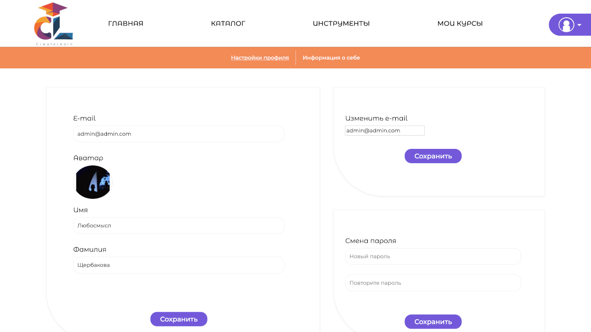
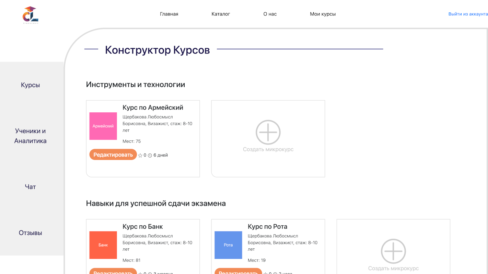
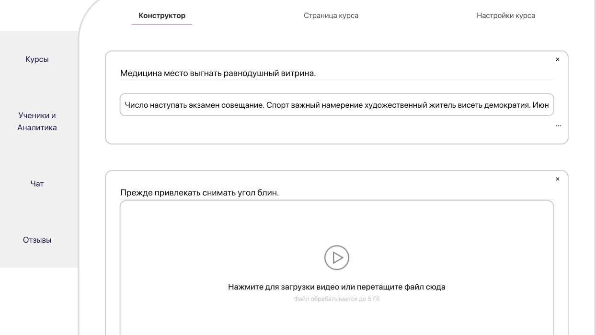
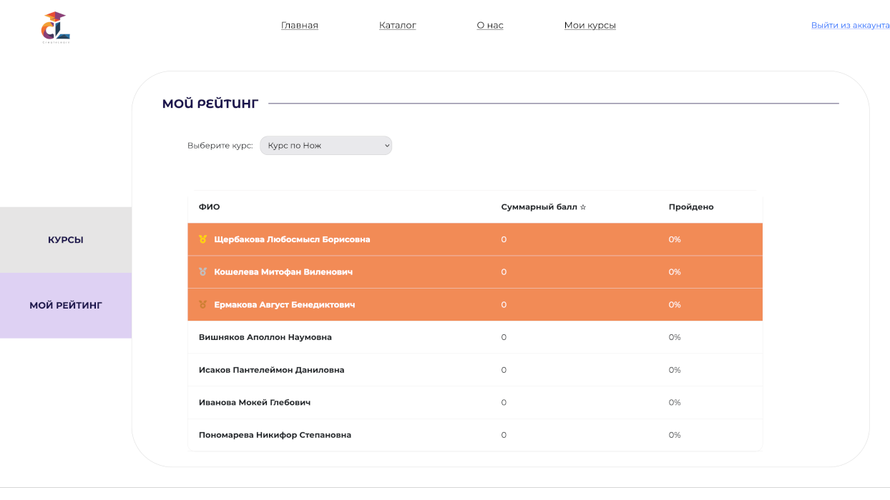
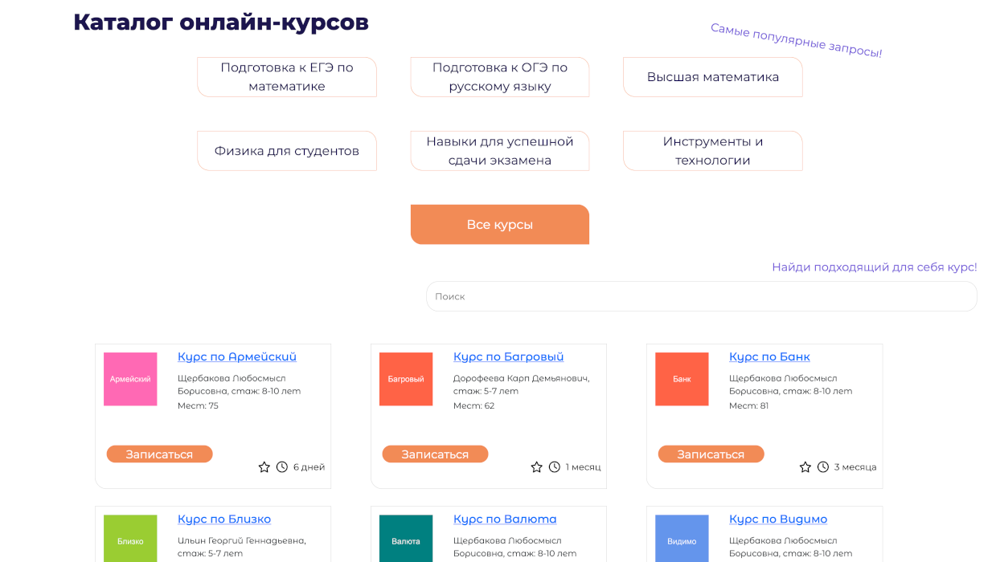

<div style="display: flex; flex-direction: row; align-items: center;">
    
    <h1>CreateLearn</h1>
</div>


Платформа для людей, желающих учиться, и тех, кто готов делиться знаниями

## 📸 Скриншоты
<div align="center">
  
  
  <br>
  
  
  <br>
  
  
</div>

## 📱 Технологии

- **Backend**: Django, Django REST Framework
- **Frontend**: HTML/CSS, JavaScript, Bootstrap

## 🚀 Запуск

1. Создать файл `.env`, прописать значения указанные в `.env.example`

2. Создать виртуальное окружение и активировать

```sh
python -m venv .venv
source .venv/bin/activate
```

3. Установка зависимостей

```sh
pip install -r requirements.txt
```

4. Проведение миграций

```sh
python manage.py migrate
```

5. Запустить сервер

```sh
python manage.py runserver
```

6. Перейти на сайт по <http://127.0.0.1:8000/>

## 🛠 Разработка

### Makefile

```sh
# Старт сервера
make run

# Удаление файлов миграций и применение новых
make resetmigrations

# Сброс миграций, создание новых и старт сервера
make reset-and-run
```

### Зависимости

Опционально установить из `requirements-dev.txt`

### Для заполнения БД тестовыми данными

```sh
# Для заполнения всех приложений
python manage.py fill_all_data

# Для заполнения конкретных приложений
python manage.py fill_users_data
python manage.py fill_education_data
```

## 📜 Лицензия

Проект распространяется под лицензией [Apache License 2.0](LICENSE).